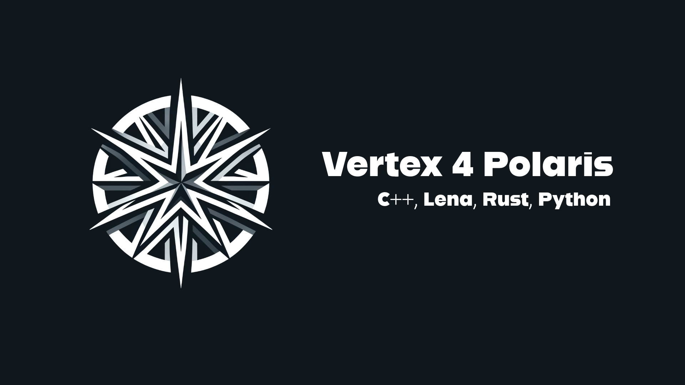

# Vertex 4 Polaris

## Basic information

* Framework for embedded systems and robots. Multilingual framework, supports: C++ (2017), Lena (2024), Rust (1.66.0), Python (3)

### Main

* Independent of development environment.
* Every template based on `makefile`.
* Maximum standardization, performance and expressiveness.
